# 🌿 FitnessApp Branch Structure & Development Workflow

## 📊 Current Branch Structure

```
🌳 Repository: BUPE-NONDO/FitnessApp
├── 🏠 main (production)
│   └── Latest stable release
│
├── 🚧 dev (development) ← INCREMENTAL UPDATES
│   ├── Design system implementation
│   ├── Enhanced UI components
│   └── Continuous feature integration
│
├── 🔐 MILESTONE 1: Enhanced Authentication
│   ├── feature/auth-google-oauth
│   ├── feature/auth-facebook-login
│   ├── feature/auth-apple-signin
│   ├── feature/profile-basic-info
│   ├── feature/profile-picture-upload
│   ├── feature/onboarding-welcome-flow
│   ├── feature/onboarding-goal-setup
│   └── feature/auth-password-reset
│
├── 📊 MILESTONE 2: Advanced Analytics
│   ├── feature/dashboard-real-time-stats
│   ├── feature/dashboard-widget-system
│   ├── feature/charts-interactive-base
│   ├── feature/charts-progress-visualization
│   ├── feature/charts-custom-builder
│   ├── feature/reports-automated-generation
│   ├── feature/reports-pdf-export
│   └── feature/analytics-pattern-recognition
│
├── 👥 MILESTONE 3: Social Features (Future)
│   ├── feature/social-connections
│   ├── feature/activity-sharing
│   ├── feature/challenges-system
│   └── feature/community-features
│
└── ... (Additional milestones as incremental features)
```

## 🔄 **NEW: Incremental Development Workflow**

### ✅ **Correct Approach**
- Small, focused feature branches (2-5 days each)
- Frequent merges to `dev` branch
- Continuous integration and testing
- Faster feedback and reduced risk

### ❌ **Previous Approach (Fixed)**
- Large milestone branches
- Infrequent, risky merges
- Integration challenges
- Delayed feedback

## 🎯 Development Milestones Overview

| Milestone | Branch | Priority | Duration | Status |
|-----------|--------|----------|----------|--------|
| **1. Enhanced Auth** | `feature/milestone-1-enhanced-auth` | 🔴 High | 2-3 weeks | 🟡 Ready |
| **2. Advanced Analytics** | `feature/milestone-2-advanced-analytics` | 🔴 High | 3-4 weeks | 🟡 Ready |
| **3. Social Features** | `feature/milestone-3-social-features` | 🟠 Medium | 4-5 weeks | ⚪ Planned |
| **4. Nutrition Tracking** | `feature/milestone-4-nutrition-tracking` | 🟠 Medium | 4-5 weeks | ⚪ Planned |
| **5. Workout Plans** | `feature/milestone-5-workout-plans` | 🟠 Medium | 5-6 weeks | ⚪ Planned |
| **6. AI Recommendations** | `feature/milestone-6-ai-recommendations` | 🟢 Low | 6-8 weeks | ⚪ Future |
| **7. Mobile App** | `feature/milestone-7-mobile-app` | 🟠 Medium | 8-10 weeks | ⚪ Future |
| **8. Premium Features** | `feature/milestone-8-premium-features` | 🟢 Low | 4-6 weeks | ⚪ Future |

## 🔄 Development Workflow

### 1. Feature Development Process

```mermaid
graph LR
    A[Create Issue] --> B[Assign to Milestone]
    B --> C[Create Feature Branch]
    C --> D[Develop Feature]
    D --> E[Create Pull Request]
    E --> F[Code Review]
    F --> G[Merge to Dev]
    G --> H[Integration Testing]
    H --> I[Deploy to Staging]
    I --> J[Merge to Main]
    J --> K[Deploy to Production]
```


### 2. Branch Naming Convention
- **Feature Branches**: `feature/milestone-X-feature-name`
- **Bug Fixes**: `bugfix/issue-number-description`
- **Hotfixes**: `hotfix/critical-issue-description`
- **Refactoring**: `refactor/component-name`

### 3. Commit Message Format
```
type(scope): description

[optional body]

[optional footer]
```

**Types**: `feat`, `fix`, `docs`, `style`, `refactor`, `test`, `chore`

## 📋 Current Implementation Status

### ✅ Completed Features
- [x] **Design System Foundation**
  - Comprehensive UI component library
  - Consistent color palette and typography
  - Dark mode support
  - Responsive design system

- [x] **Core Functionality**
  - Goal creation and management
  - Activity logging
  - Basic analytics and charts
  - User authentication (basic)

- [x] **Technical Infrastructure**
  - Firebase integration
  - Real-time data operations
  - Testing framework
  - CI/CD pipeline

### 🚧 In Progress
- [ ] **Enhanced UI/UX**
  - Advanced component interactions
  - Animation system
  - Mobile optimization

### 🎯 Next Priority (Milestone 1)
- [ ] **Enhanced Authentication**
  - Social login integration
  - Advanced user profiles
  - Onboarding experience
  - Account management

## 🛠 Development Environment Setup

### Prerequisites
- Node.js 18+
- pnpm package manager
- Firebase CLI
- Git

### Getting Started
```bash
# Clone repository
git clone https://github.com/BUPE-NONDO/FitnessApp.git
cd FitnessApp

# Install dependencies
pnpm install

# Start development server
cd apps/web
pnpm dev

# Run tests
pnpm test

# Build for production
pnpm build
```

### Working with Feature Branches
```bash
# Switch to development branch
git checkout dev

# Create new feature branch
git checkout -b feature/milestone-1-new-feature

# Make changes and commit
git add .
git commit -m "feat(auth): add new authentication feature"

# Push to remote
git push origin feature/milestone-1-new-feature

# Create pull request to dev branch
```

## 📊 Project Management

### GitHub Integration
- **Repository**: https://github.com/BUPE-NONDO/FitnessApp
- **Project Board**: GitHub Projects for milestone tracking
- **Issues**: Detailed feature and bug tracking
- **Pull Requests**: Code review and integration

### Documentation
- **Development Roadmap**: `/docs/development-roadmap.md`
- **Design System**: `/docs/design-system.md`
- **Milestone Details**: `/docs/milestones/`
- **GitHub Setup**: `/docs/github-project-setup.md`

### Live Deployments
- **Production**: https://fitness-app-bupe-staging.web.app
- **Development**: Auto-deployed from dev branch
- **Feature Previews**: Available for each feature branch

## 🎯 Success Metrics

### Development Metrics
- **Code Quality**: ESLint, Prettier, TypeScript strict mode
- **Test Coverage**: >80% unit test coverage
- **Performance**: Lighthouse scores >90
- **Accessibility**: WCAG 2.1 AA compliance

### User Metrics
- **User Engagement**: Daily/monthly active users
- **Feature Adoption**: Usage rates for new features
- **Performance**: Page load times, interaction responsiveness
- **Satisfaction**: User feedback and ratings

## 🚀 Next Steps

### Immediate Actions (Week 1)
1. **Start Milestone 1 Development**
   - Begin enhanced authentication features
   - Set up social login providers
   - Create user profile management

2. **Project Management Setup**
   - Create GitHub project board
   - Set up issue templates
   - Define sprint schedule

3. **Team Coordination**
   - Assign milestone responsibilities
   - Schedule regular standups
   - Plan code review process

### Short-term Goals (Month 1)
- Complete Milestone 1 (Enhanced Authentication)
- Begin Milestone 2 (Advanced Analytics)
- Establish development rhythm
- Gather user feedback

### Long-term Vision (6 Months)
- Complete first 4 milestones
- Launch mobile application
- Implement AI recommendations
- Scale user base and features

---

**🎉 Development structure is ready! Time to build amazing fitness features!** 🚀
