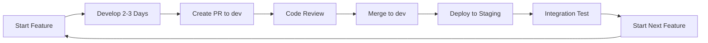

# ✅ Corrected Development Workflow Summary

## 🎯 Problem Identified and Fixed

### ❌ **Previous Approach (Incorrect)**
```
dev ← milestone-1-enhanced-auth (entire milestone, weeks of work)
dev ← milestone-2-advanced-analytics (entire milestone, weeks of work)
```
**Issues:**
- Large, long-running feature branches
- Infrequent merges causing integration hell
- Delayed feedback and testing
- High risk of merge conflicts
- Difficult code reviews

### ✅ **Corrected Approach (Incremental)**
```
dev ← feature/auth-google-oauth (3 days)
dev ← feature/profile-basic-info (2 days)
dev ← feature/onboarding-welcome-flow (2 days)
dev ← feature/dashboard-real-time-stats (3 days)
```
**Benefits:**
- Small, focused feature branches
- Frequent merges (every 2-3 days)
- Continuous integration and testing
- Faster feedback loops
- Easier code reviews
- Reduced risk

## 🌿 **New Branch Structure**

### Main Branches
- **`main`** - Production releases
- **`dev`** - Continuous integration (updated every 2-3 days)

### Feature Branches (Small & Focused)
```
🔐 Authentication Features:
├── feature/auth-google-oauth (3 days)
├── feature/auth-facebook-login (2 days)
├── feature/auth-apple-signin (2 days)
├── feature/profile-basic-info (2 days)
├── feature/profile-picture-upload (3 days)
├── feature/onboarding-welcome-flow (2 days)
├── feature/onboarding-goal-setup (3 days)
└── feature/auth-password-reset (2 days)

📊 Analytics Features:
├── feature/dashboard-real-time-stats (3 days)
├── feature/dashboard-widget-system (2 days)
├── feature/charts-interactive-base (3 days)
├── feature/charts-progress-visualization (2 days)
├── feature/charts-custom-builder (4 days)
├── feature/reports-automated-generation (3 days)
├── feature/reports-pdf-export (2 days)
└── feature/analytics-pattern-recognition (4 days)
```

## 🔄 **Incremental Development Workflow**

### Daily Development Cycle


### Sprint Structure (2 weeks)
- **Week 1**: 3-4 small features
- **Week 2**: 3-4 small features + integration
- **Total**: 6-8 features per sprint

## 📋 **Sprint 1 Plan (Ready to Execute)**

### Week 1 (Days 1-5)
| Feature | Branch | Effort | Developer | Status |
|---------|--------|--------|-----------|--------|
| Google OAuth | `feature/auth-google-oauth` | 3 days | TBD | 🟡 Ready |
| Basic Profile | `feature/profile-basic-info` | 2 days | TBD | 🟡 Ready |

### Week 2 (Days 6-10)
| Feature | Branch | Effort | Developer | Status |
|---------|--------|--------|-----------|--------|
| Welcome Flow | `feature/onboarding-welcome-flow` | 2 days | TBD | 🟡 Ready |
| Password Reset | `feature/auth-password-reset` | 2 days | TBD | 🟡 Ready |
| Integration | Testing & Polish | 1 day | Team | 🟡 Ready |

### Sprint 1 Deliverables
- ✅ Google OAuth authentication
- ✅ Basic profile management
- ✅ User onboarding flow
- ✅ Password reset functionality
- ✅ All features integrated in dev branch

## 📊 **Progress Tracking**

### Feature-Level Tracking
```
Milestone 1 Progress: 0/8 features complete (0%)
├── 🟡 feature/auth-google-oauth (ready)
├── 🟡 feature/profile-basic-info (ready)
├── 🟡 feature/onboarding-welcome-flow (ready)
├── 📋 feature/auth-password-reset (planned)
├── 📋 feature/auth-facebook-login (planned)
├── 📋 feature/profile-picture-upload (planned)
├── 📋 feature/onboarding-goal-setup (planned)
└── 📋 feature/profile-privacy-settings (planned)
```

### Continuous Integration to Dev
```
dev branch updates:
├── Week 1: +2 features merged
├── Week 2: +2 features merged
├── Week 3: +2 features merged
└── Week 4: +2 features merged
```

## 🛠 **Technical Implementation**

### Feature Branch Workflow
1. **Create**: `git checkout dev && git checkout -b feature/auth-google-oauth`
2. **Develop**: Work for 2-3 days with frequent commits
3. **Test**: Write unit, integration, and E2E tests
4. **Review**: Create PR to dev branch
5. **Merge**: Merge after approval and CI passes
6. **Deploy**: Auto-deploy to staging for testing

### Branch Naming Convention
```
feature/[component]-[specific-feature]

Examples:
✅ feature/auth-google-oauth
✅ feature/profile-basic-info
✅ feature/dashboard-real-time-stats
✅ feature/charts-interactive-base

❌ feature/milestone-1-enhanced-auth (too large)
❌ feature/authentication (too vague)
```

## 📚 **Documentation Created**

### Workflow Documentation
- ✅ `docs/incremental-development-workflow.md` - Complete workflow guide
- ✅ `docs/sprint-planning.md` - Sprint structure and planning
- ✅ `docs/corrected-workflow-summary.md` - This summary

### Feature Documentation
- ✅ `docs/features/feature-auth-google-oauth.md` - Google OAuth implementation
- ✅ `docs/features/feature-profile-basic-info.md` - Profile management
- 📋 Additional feature docs to be created as needed

### Project Structure
- ✅ Updated branch structure documentation
- ✅ Clear milestone breakdown into features
- ✅ Sprint planning templates

## 🎯 **Success Metrics**

### Development Velocity
- **Target**: 6-8 features per 2-week sprint
- **Feature Size**: 2-3 days each
- **Merge Frequency**: Every 2-3 days to dev
- **Integration Issues**: <1 per sprint

### Quality Metrics
- **Test Coverage**: >80% per feature
- **Bug Rate**: <2 bugs per feature
- **Code Review Time**: <24 hours
- **CI/CD Success Rate**: >95%

## 🚀 **Next Steps**

### Immediate Actions (This Week)
1. **Assign Features**: Assign first sprint features to developers
2. **Start Development**: Begin with `feature/auth-google-oauth`
3. **Set Up CI/CD**: Ensure automated testing and deployment
4. **Create Issues**: GitHub issues for each feature

### Short-term Goals (Next 2 Weeks)
1. **Complete Sprint 1**: Deliver 4 authentication features
2. **Validate Workflow**: Ensure process works smoothly
3. **Plan Sprint 2**: Define next set of features
4. **Gather Feedback**: Team retrospective on new workflow

### Long-term Vision (Next 2 Months)
1. **Complete Milestone 1**: All authentication features
2. **Begin Milestone 2**: Advanced analytics features
3. **Optimize Process**: Continuous improvement
4. **Scale Team**: Onboard additional developers

## ✅ **Workflow Validation**

### Checklist for Success
- [x] **Small Feature Branches**: 2-3 days each
- [x] **Clear Documentation**: Each feature well-documented
- [x] **Sprint Planning**: 2-week sprints with 6-8 features
- [x] **Continuous Integration**: Frequent merges to dev
- [x] **Quality Gates**: Testing and review requirements
- [x] **Progress Tracking**: Feature-level visibility

### Ready for Development
- [x] **Branch Structure**: Correct incremental approach
- [x] **Feature Definitions**: Clear acceptance criteria
- [x] **Development Process**: Documented workflow
- [x] **Team Alignment**: Everyone understands approach
- [x] **Tools Setup**: GitHub, CI/CD, testing ready

---

**🎉 Corrected workflow is ready for professional incremental development!** 

The development team can now work efficiently with:
- ✅ Small, manageable feature branches
- ✅ Frequent integration to dev branch
- ✅ Continuous feedback and testing
- ✅ Reduced risk and faster delivery
- ✅ Professional development practices

**Ready to start Sprint 1 with `feature/auth-google-oauth`!** 🚀
