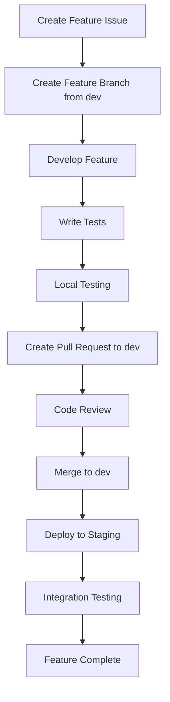

# 🔄 Incremental Development Workflow

## 🎯 Correct Development Strategy

### ❌ **Wrong Approach (What We Had)**
```
dev ← milestone-1-enhanced-auth (entire milestone)
dev ← milestone-2-advanced-analytics (entire milestone)
```

### ✅ **Correct Approach (Incremental)**
```
dev ← feature/auth-social-login
dev ← feature/auth-profile-management
dev ← feature/auth-onboarding-wizard
dev ← feature/analytics-interactive-charts
dev ← feature/analytics-dashboard-widgets
```

## 🌿 **New Branch Structure**

### Main Branches
- **`main`** - Production releases
- **`dev`** - Integration branch (updated incrementally)

### Feature Branches (Small, Focused)
Each feature branch should:
- ✅ Implement ONE specific feature
- ✅ Be completable in 2-5 days
- ✅ Be independently testable
- ✅ Merge to `dev` when complete

## 📋 **Milestone 1: Enhanced Authentication**
**Broken into incremental features:**

### 1. Social Authentication Features
- `feature/auth-google-oauth` - Google Sign-In integration
- `feature/auth-facebook-login` - Facebook authentication
- `feature/auth-apple-signin` - Apple ID authentication
- `feature/auth-github-login` - GitHub authentication

### 2. User Profile Features
- `feature/profile-basic-info` - Basic profile management
- `feature/profile-picture-upload` - Profile picture functionality
- `feature/profile-fitness-assessment` - Fitness level questionnaire
- `feature/profile-privacy-settings` - Privacy controls

### 3. Onboarding Features
- `feature/onboarding-welcome-flow` - Welcome wizard
- `feature/onboarding-goal-setup` - Initial goal setting
- `feature/onboarding-tutorial` - App tutorial system
- `feature/onboarding-progress-tracking` - Completion tracking

### 4. Account Management Features
- `feature/auth-password-reset` - Password reset functionality
- `feature/auth-email-verification` - Email verification system
- `feature/auth-two-factor` - Two-factor authentication
- `feature/account-data-export` - GDPR data export
- `feature/account-deletion` - Account deletion workflow

## 📊 **Milestone 2: Advanced Analytics**
**Broken into incremental features:**

### 1. Dashboard Enhancement
- `feature/dashboard-real-time-stats` - Live statistics
- `feature/dashboard-quick-actions` - Action buttons
- `feature/dashboard-widget-system` - Customizable widgets
- `feature/dashboard-responsive-layout` - Mobile optimization

### 2. Chart System
- `feature/charts-interactive-base` - Interactive chart foundation
- `feature/charts-progress-visualization` - Progress charts
- `feature/charts-trend-analysis` - Trend visualization
- `feature/charts-comparison-tools` - Comparison charts
- `feature/charts-custom-builder` - Chart builder interface

### 3. Reporting System
- `feature/reports-automated-generation` - Auto-generated reports
- `feature/reports-pdf-export` - PDF export functionality
- `feature/reports-email-delivery` - Email report delivery
- `feature/reports-custom-templates` - Custom report builder

### 4. Analytics Engine
- `feature/analytics-pattern-recognition` - Pattern detection
- `feature/analytics-predictions` - Predictive analytics
- `feature/analytics-recommendations` - Smart recommendations
- `feature/analytics-correlation-analysis` - Data correlations

## 🔄 **Development Workflow**

### 1. Feature Development Process


### 2. Branch Naming Convention
```
feature/[component]-[specific-feature]

Examples:
- feature/auth-google-oauth
- feature/profile-picture-upload
- feature/dashboard-real-time-stats
- feature/charts-interactive-base
```

### 3. Pull Request Process
- **Target**: Always merge to `dev` branch
- **Size**: Small, focused changes (< 500 lines)
- **Testing**: Include unit and integration tests
- **Review**: Require at least 1 approval
- **CI/CD**: All checks must pass

## 📅 **Sprint Planning**

### Sprint Structure (2 weeks)
- **Week 1**: 3-4 small features
- **Week 2**: 3-4 small features + integration testing

### Example Sprint 1 (Milestone 1 Start)
- `feature/auth-google-oauth` (3 days)
- `feature/profile-basic-info` (2 days)
- `feature/onboarding-welcome-flow` (4 days)
- `feature/auth-password-reset` (2 days)
- Integration testing (1 day)

### Example Sprint 2 (Milestone 1 Continue)
- `feature/auth-facebook-login` (2 days)
- `feature/profile-picture-upload` (3 days)
- `feature/onboarding-goal-setup` (3 days)
- `feature/profile-privacy-settings` (2 days)
- Bug fixes and polish (2 days)

## 🧪 **Testing Strategy**

### Per Feature Branch
- **Unit Tests**: Test individual functions/components
- **Integration Tests**: Test feature integration
- **E2E Tests**: Test complete user workflows
- **Manual Testing**: UI/UX validation

### Dev Branch Integration
- **Regression Testing**: Ensure existing features work
- **Performance Testing**: Check for performance impacts
- **Cross-browser Testing**: Compatibility validation
- **Mobile Testing**: Responsive design verification

## 📊 **Progress Tracking**

### Feature-Level Tracking
```
Milestone 1 Progress: 3/15 features complete (20%)
├── ✅ feature/auth-google-oauth (merged)
├── ✅ feature/profile-basic-info (merged)
├── ✅ feature/onboarding-welcome-flow (merged)
├── 🚧 feature/auth-facebook-login (in progress)
├── 📋 feature/profile-picture-upload (ready)
└── ... (remaining features)
```

### Sprint Velocity
- **Completed Features per Sprint**: Target 6-8 features
- **Story Points**: Assign points based on complexity
- **Burn-down Charts**: Track sprint progress
- **Velocity Trends**: Improve estimation over time

## 🎯 **Benefits of Incremental Approach**

### ✅ **Advantages**
- **Faster Feedback**: Quick validation of individual features
- **Reduced Risk**: Smaller changes = fewer bugs
- **Better Testing**: Focused testing per feature
- **Easier Reviews**: Smaller PRs are easier to review
- **Continuous Integration**: Always have working dev branch
- **Flexible Planning**: Can reprioritize features easily

### 🚫 **Avoids Problems**
- Large merge conflicts
- Integration hell
- Long-running feature branches
- Delayed feedback
- Difficult debugging
- Blocked team members

## 🚀 **Implementation Plan**

### Phase 1: Restructure Current Branches
1. Keep milestone branches for reference
2. Create first incremental feature branches
3. Update documentation and workflow
4. Train team on new process

### Phase 2: Begin Incremental Development
1. Start with `feature/auth-google-oauth`
2. Complete, test, and merge to dev
3. Deploy to staging for validation
4. Continue with next feature

### Phase 3: Establish Rhythm
1. 2-week sprints with 6-8 features
2. Regular retrospectives
3. Continuous process improvement
4. Milestone completion celebrations

## 📝 **Next Actions**

### Immediate (This Week)
1. Create first incremental feature branches
2. Update GitHub project board structure
3. Define feature-level acceptance criteria
4. Begin development on first feature

### Short-term (Next 2 Weeks)
1. Complete first sprint of incremental features
2. Validate workflow effectiveness
3. Adjust process based on learnings
4. Plan next sprint features

---

**🎯 Ready to implement proper incremental development workflow!** 🚀
